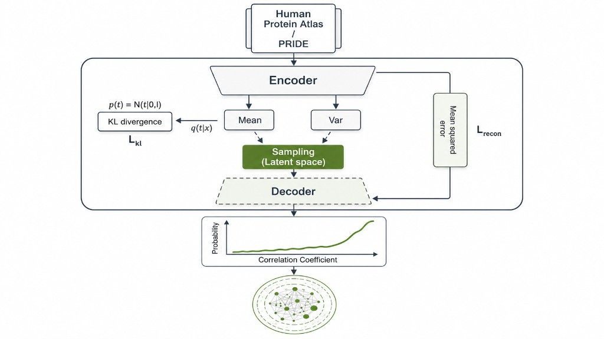

#  FAVA: Functional Associations using Variational Autoencoders


[](https://badge.fury.io/py/favapy)
[](https://fava.readthedocs.io/en/latest/?badge=latest)
[](https://github.com/shahrozeabbas/favapy/actions/workflows/test.yaml)
<a href="https://scverse.org"><picture><source media="(prefers-color-scheme: dark)" srcset="https://img.shields.io/badge/scverse-ecosystem-0969da.svg?logo=data:image/svg%2bxml;base64,PCFET0NUWVBFIHN2ZyBQVUJMSUMgIi0vL1czQy8vRFREIFNWRyAxLjEvL0VOIiAiaHR0cDovL3d3dy53My5vcmcvR3JhcGhpY3MvU1ZHLzEuMS9EVEQvc3ZnMTEuZHRkIj48c3ZnIHdpZHRoPSIxMDAlIiBoZWlnaHQ9IjEwMCUiIHZpZXdCb3g9IjAgMCA4NyA5MiIgdmVyc2lvbj0iMS4xIiB4bWxucz0iaHR0cDovL3d3dy53My5vcmcvMjAwMC9zdmciIHhtbG5zOnhsaW5rPSJodHRwOi8vd3d3LnczLm9yZy8xOTk5L3hsaW5rIiB4bWw6c3BhY2U9InByZXNlcnZlIiB4bWxuczpzZXJpZj0iaHR0cDovL3d3dy5zZXJpZi5jb20vIiBzdHlsZT0iZmlsbC1ydWxlOmV2ZW5vZGQ7Y2xpcC1ydWxlOmV2ZW5vZGQ7c3Ryb2tlLWxpbmVqb2luOnJvdW5kO3N0cm9rZS1taXRlcmxpbWl0OjEwOyI+PGc+PHBhdGggaWQ9InBhdGgyNDMxIiBkPSJNMzMuMzg2LDkwLjU3OGMtMjIuMywtMy40MDMgLTMwLjYwMSwtMTkuODAxIC0zMC42MDEsLTE5LjgwMWMxMC44MDEsMTYuODk4IDQzLDkuMTAxIDUyLjkwMiwyLjVjMTIuMzk5LC04LjMwMSA4LC0xNS4zMDEgNi43OTcsLTE4LjEwMmM1LjQwMiw3LjIwMyA1LjMwMSwyMy41IC0xLjA5OCwyOS40MDNjLTUuNjAxLDUuMDk3IC0xNS4zLDcuODk4IC0yOCw2WiIgc3R5bGU9ImZpbGw6I2ZmZjtmaWxsLXJ1bGU6bm9uemVybztzdHJva2U6IzAwMDtzdHJva2Utd2lkdGg6MXB4OyIvPjxwYXRoIGlkPSJwYXRoMjQzMyIgZD0iTTgyLjI4NSw0NC40NzZjMi45MDIsLTcuMDk4IDAuODAxLC0xMi41IDAuNSwtMTMuMzAxYy0wLjY5OSwtMS4yOTcgLTEuNSwtMi4yOTcgLTIuMzk5LC0zLjA5N2MtMTYuMTAxLC0xMi42MDIgLTU1LjkwMiwxIC03MC45MDIsMTYuOGMtMTAuODk4LDExLjUgLTEwLjA5OCwyMCAtNi42OTksMjUuNzk3YzMuMTAxLDQuODAxIDcuOTAyLDcuNjAyIDEzLjQwMiw5Yy0xMS41LC0xMi4zOTggOS43OTcsLTMxLjA5NyAyOSwtMzhjMjEsLTcuNSAzMi41LC0zIDM3LjA5OCwyLjgwMVoiIHN0eWxlPSJmaWxsOiMzNDM0MzQ7ZmlsbC1ydWxlOmVub3plcm87c3Ryb2tlOiMwMDA7c3Ryb2tlLXdpZHRoOjFweDsiLz48cGF0aCBpZD0icGF0aDI0MzUiIGQ9Ik03Ny45ODQsNTEuMzc4YzksLTEwLjUgNSwtMTkuNzAzIDQuODAxLC0yMC40MDJjLTAsLTAgNC40MDIsNy4xMDEgMi4xOTksMjIuNjAyYy0xLjE5OSw4LjQ5OSAtNS4zOTgsMTUuOTk5IC0xMC4wOTgsMTEuOGMtMi4xMDEsLTEuOCAtMywtNi45MDIgMy4wOTgsLTE0WiIgc3R5bGU9ImZpbGw6I2ZmZjtmaWxsLXJ1bGU6bm9uemVybztzdHJva2U6IzAwMDtzdHJva2Utd2lkdGg6MXB4OyIvPjxwYXRoIGlkPSJwYXRoMjQzNyIgZD0iTTYyLjM4Niw1NS4xNzVjLTMuMywtNC43OTcgLTguMTAxLC03LjM5OCAtMTIuMywtMTAuNzk3Yy0yLjIsLTEuNzAzIC0xNi4zOTksLTExLjIwMyAtMTkuMiwtMTUuMTAxYy02LjQwMiwtNi4zOTkgLTkuNSwtMTYuODk5IC0zLjQwMiwtMjMuMTAyYy00LjM5OCwtMC43OTcgLTguMTk5LDAuMjAzIC0xMC41OTgsMS41Yy0xLjEwMSwwLjYwMiAtMi4xMDEsMS4yMDMgLTIuOCwyYy02LjcsNi4yMDMgLTUuODAxLDE3IC0xLjYwMiwyNC4zMDFjNC41LDcuODAxIDEzLjIwMywxNS40MDIgMjQuMzAxLDIyLjgwMWM1LjEwMSwzLjM5OCAxNS42MDEsOC4zOTggMTkuMzAxLDE2YzExLjY5OSwtOC4xMDIgNy42MDEsLTE0Ljg5OSA2LjMsLTE3LjYwMloiIHN0eWxlPSJmaWxsOiNiNGI0YjQ7ZmlsbC1ydWxlOm5vbnplcm87c3Ryb2tlOiMwMDA7c3Ryb2tlLXdpZHRoOjFweDsiLz48cGF0aCBpZD0icGF0aDI0MzkiIGQ9Ik0zNy4wODYsMTAuNzc3YzcuODk4LDYuMyAxMi4zOTgsOS44MDEgMjAsOC41YzUuNjk5LC0xIDQuODk4LC03Ljg5OSAtNCwtMTMuNjAyYy00LjM5OSwtMi43OTcgLTkuMzk5LC00LjE5OSAtMTUuNywtNC4xOTljLTcuNSwtMCAtMTYuMywzLjkwMiAtMjAuNjAxLDYuNDAyYzQsLTIuMzAxIDExLjkwMiwtMy44MDEgMjAuMzAxLDIuODk5WiIgc3R5bGU9ImZpbGw6I2ZmZjtmaWxsLXJ1bGU6bm9uemVybztzdHJva2U6IzAwMDtzdHJva2Utd2lkdGg6MXB4OyIvPjwvZz48L3N2Zz4="><source media="(prefers-color-scheme: light)" srcset="https://img.shields.io/badge/scverse-ecosystem-lightgrey.svg?logo=data:image/svg%2bxml;base64,PCFET0NUWVBFIHN2ZyBQVUJMSUMgIi0vL1czQy8vRFREIFNWRyAxLjEvL0VOIiAiaHR0cDovL3d3dy53My5vcmcvR3JhcGhpY3MvU1ZHLzEuMS9EVEQvc3ZnMTEuZHRkIj48c3ZnIHdpZHRoPSIxMDAlIiBoZWlnaHQ9IjEwMCUiIHZpZXdCb3g9IjAgMCA4NyA5MiIgdmVyc2lvbj0iMS4xIiB4bWxucz0iaHR0cDovL3d3dy53My5vcmcvMjAwMC9zdmciIHhtbG5zOnhsaW5rPSJodHRwOi8vd3d3LnczLm9yZy8xOTk5L3hsaW5rIiB4bWw6c3BhY2U9InByZXNlcnZlIiB4bWxuczpzZXJpZj0iaHR0cDovL3d3dy5zZXJpZi5jb20vIiBzdHlsZT0iZmlsbC1ydWxlOmV2ZW5vZGQ7Y2xpcC1ydWxlOmV2ZW5vZGQ7c3Ryb2tlLWxpbmVqb2luOnJvdW5kO3N0cm9rZS1taXRlcmxpbWl0OjEwOyI+PGc+PHBhdGggaWQ9InBhdGgyNDMxIiBkPSJNMzMuMzg2LDkwLjU3OGMtMjIuMywtMy40MDMgLTMwLjYwMSwtMTkuODAxIC0zMC42MDEsLTE5LjgwMWMxMC44MDEsMTYuODk4IDQzLDkuMTAxIDUyLjkwMiwyLjVjMTIuMzk5LC04LjMwMSA4LC0xNS4zMDEgNi43OTcsLTE4LjEwMmM1LjQwMiw3LjIwMyA1LjMwMSwyMy41IC0xLjA5OCwyOS40MDNjLTUuNjAxLDUuMDk3IC0xNS4zLDcuODk4IC0yOCw2WiIgc3R5bGU9ImZpbGw6I2ZmZjtmaWxsLXJ1bGU6bm9uemVybztzdHJva2U6IzAwMDtzdHJva2Utd2lkdGg6MXB4OyIvPjxwYXRoIGlkPSJwYXRoMjQzMyIgZD0iTTgyLjI4NSw0NC40NzZjMi45MDIsLTcuMDk4IDAuODAxLC0xMi41IDAuNSwtMTMuMzAxYy0wLjY5OSwtMS4yOTcgLTEuNSwtMi4yOTcgLTIuMzk5LC0zLjA5N2MtMTYuMTAxLC0xMi42MDIgLTU1LjkwMiwxIC03MC45MDIsMTYuOGMtMTAuODk4LDExLjUgLTEwLjA5OCwyMCAtNi42OTksMjUuNzk3YzMuMTAxLDQuODAxIDcuOTAyLDcuNjAyIDEzLjQwMiw5Yy0xMS41LC0xMi4zOTggOS43OTcsLTMxLjA5NyAyOSwtMzhjMjEsLTcuNSAzMi41LC0zIDM3LjA5OCwyLjgwMVoiIHN0eWxlPSJmaWxsOiMzNDM0MzQ7ZmlsbC1ydWxlOmVub3plcm87c3Ryb2tlOiMwMDA7c3Ryb2tlLXdpZHRoOjFweDsiLz48cGF0aCBpZD0icGF0aDI0MzUiIGQ9Ik03Ny45ODQsNTEuMzc4YzksLTEwLjUgNSwtMTkuNzAzIDQuODAxLC0yMC40MDJjLTAsLTAgNC40MDIsNy4xMDEgMi4xOTksMjIuNjAyYy0xLjE5OSw4LjQ5OSAtNS4zOTgsMTUuOTk5IC0xMC4wOTgsMTEuOGMtMi4xMDEsLTEuOCAtMywtNi45MDIgMy4wOTgsLTE0WiIgc3R5bGU9ImZpbGw6I2ZmZjtmaWxsLXJ1bGU6bm9uemVybztzdHJva2U6IzAwMDtzdHJva2Utd2lkdGg6MXB4OyIvPjxwYXRoIGlkPSJwYXRoMjQzNyIgZD0iTTYyLjM4Niw1NS4xNzVjLTMuMywtNC43OTcgLTguMTAxLC03LjM5OCAtMTIuMywtMTAuNzk3Yy0yLjIsLTEuNzAzIC0xNi4zOTksLTExLjIwMyAtMTkuMiwtMTUuMTAxYy02LjQwMiwtNi4zOTkgLTkuNSwtMTYuODk5IC0zLjQwMiwtMjMuMTAyYy00LjM5OCwtMC43OTcgLTguMTk5LDAuMjAzIC0xMC41OTgsMS41Yy0xLjEwMSwwLjYwMiAtMi4xMDEsMS4yMDMgLTIuOCwyYy02LjcsNi4yMDMgLTUuODAxLDE3IC0xLjYwMiwyNC4zMDFjNC41LDcuODAxIDEzLjIwMywxNS40MDIgMjQuMzAxLDIyLjgwMWM1LjEwMSwzLjM5OCAxNS42MDEsOC4zOTggMTkuMzAxLDE2YzExLjY5OSwtOC4xMDIgNy42MDEsLTE0Ljg5OSA2LjMsLTE3LjYwMloiIHN0eWxlPSJmaWxsOiNiNGI0YjQ7ZmlsbC1ydWxlOm5vbnplcm87c3Ryb2tlOiMwMDA7c3Ryb2tlLXdpZHRoOjFweDsiLz48cGF0aCBpZD0icGF0aDI0MzkiIGQ9Ik0zNy4wODYsMTAuNzc3YzcuODk4LDYuMyAxMi4zOTgsOS44MDEgMjAsOC41YzUuNjk5LC0xIDQuODk4LC03Ljg5OSAtNCwtMTMuNjAyYy00LjM5OSwtMi43OTcgLTkuMzk5LC00LjE5OSAtMTUuNywtNC4xOTljLTcuNSwtMCAtMTYuMywzLjkwMiAtMjAuNjAxLDYuNDAyYzQsLTIuMzAxIDExLjkwMiwtMy44MDEgMjAuMzAxLDIuODk5WiIgc3R5bGU9ImZpbGw6I2ZmZjtmaWxsLXJ1bGU6bm9uemVybztzdHJva2U6IzAwMDtzdHJva2Utd2lkdGg6MXB4OyIvPjwvZz48L3N2Zz4="></picture></a>

FAVA is a method used to construct protein networks based on omics data such as single-cell RNA sequencing (scRNA-seq) and proteomics. Existing protein networks are often biased towards well-studied proteins, limiting their ability to reveal functions of understudied proteins. FAVA addresses this issue by leveraging omics data that are not influenced by literature bias.
Read the [documentation](https://fava.readthedocs.io/en/latest/).





## Data availability
[The Combined Network](https://doi.org/10.5281/zenodo.6803472)

## Installation
```
pip install favapy
```

## Python API

favapy 2.x uses a PyTorch Lightning backend. Train and infer association networks with:

```python
from favapy import FAVA

model = FAVA(
    data,
    n_hidden=None,
    n_latents=None,
)

network = (
    model.cook(max_epochs=50, batch_size=32)
    .get_association_network(metric='pearson', interaction_count=100_000)
)
```

`data` can be an `AnnData` object or a `pandas.DataFrame` with genes as rows and cells/samples as columns.

### Key parameters

- `n_hidden`: hidden layer size. Auto-selected from input width when `None`.
- `n_latents`: latent dimension. Auto-selected from `n_hidden` when `None`.
- `metric`: `'pearson'` or `'spearman'`.
- `interaction_count`: maximum number of gene pairs to return.
- `cc_cutoff`: correlation cutoff; overrides `interaction_count` when set.

If FAVA is useful for your research, consider citing [FAVA BiorXiv](https://doi.org/10.1101/2022.07.06.499022).

#### Other Relevant publications:
[The STRING database in 2023](https://doi.org/10.1093/nar/gkac1000)
